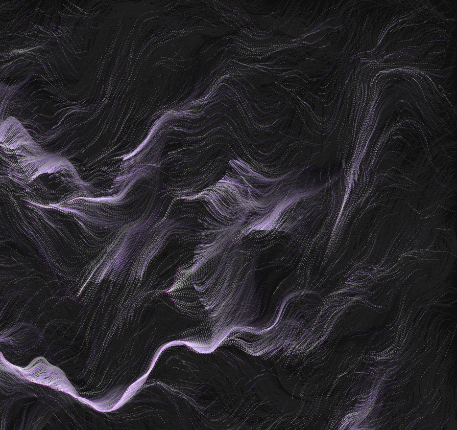
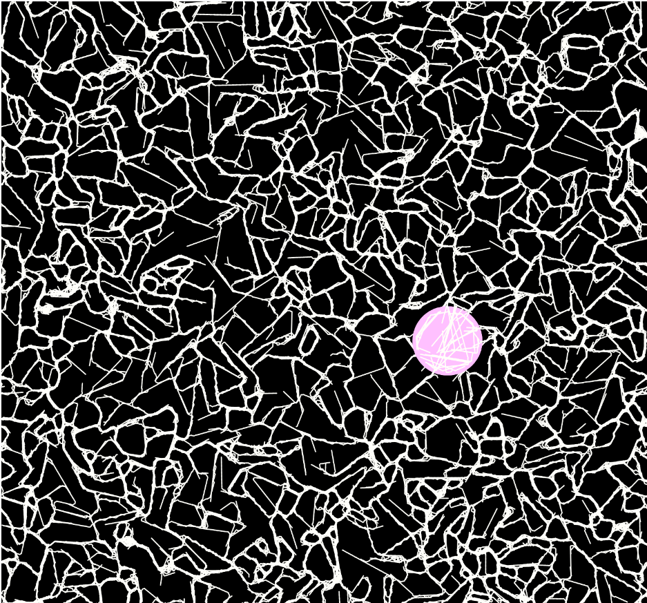
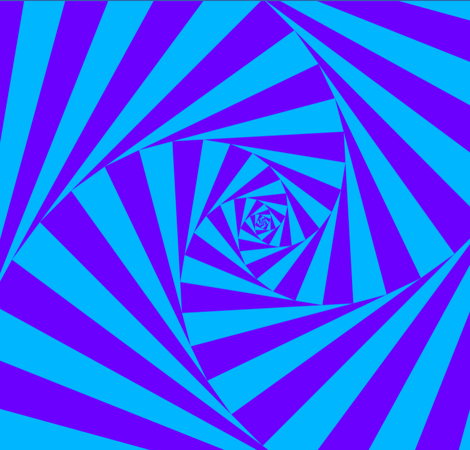
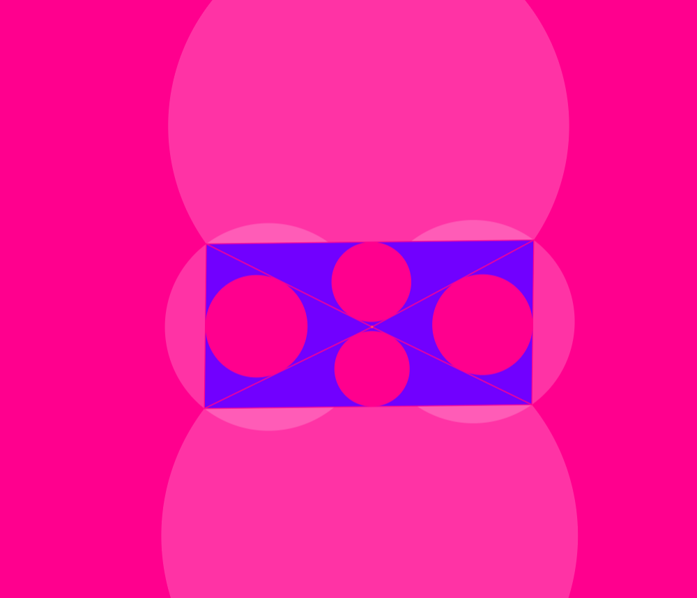
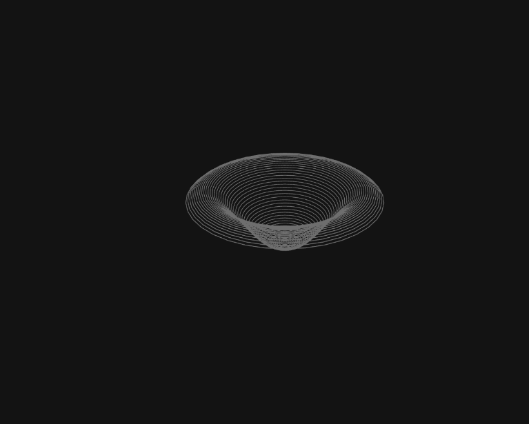
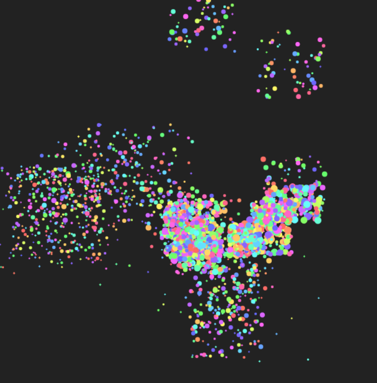

# Generative art

## Project Overzicht

Dit project is een verzameling van interactieve visualisaties gemaakt met behulp van de P5.js- en Pts.js-bibliotheken en HTML5 Canvas. Het toont creatieve en dynamische patronen door generatieve kunst. Ontdek zelf wat er gebeurt als men ervover hovert met de muis. De visualisaties zijn verdeeld in verschillende modules, elk met een eigen HTML-bestand, bijbehorend JavaScript-bestand en een gedeeld stijlbestand.

## Het Project Uitvoeren

1. Open het bestand `index.html` in een webbrowser om toegang te krijgen tot de hoofdpagina.

## Werken

1. Gemaakt met P5.js-bibliotheek

1. Gemaakt met P5.js-bibliotheek

3. Gemaakt met Pts.js-bibliotheek

4. Gemaakt met Pts.js-bibliotheek

5. Gemaakt met HTML5 P5.js-bibliotheek

1. Gemaakt met HTML5 Canvas

